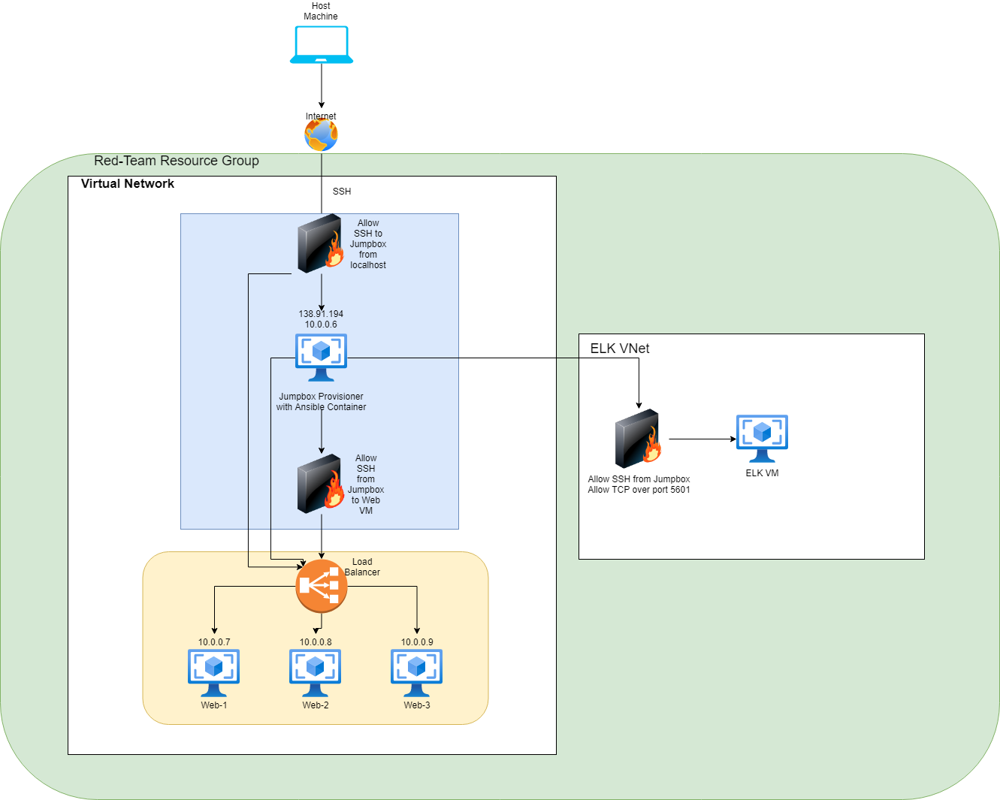
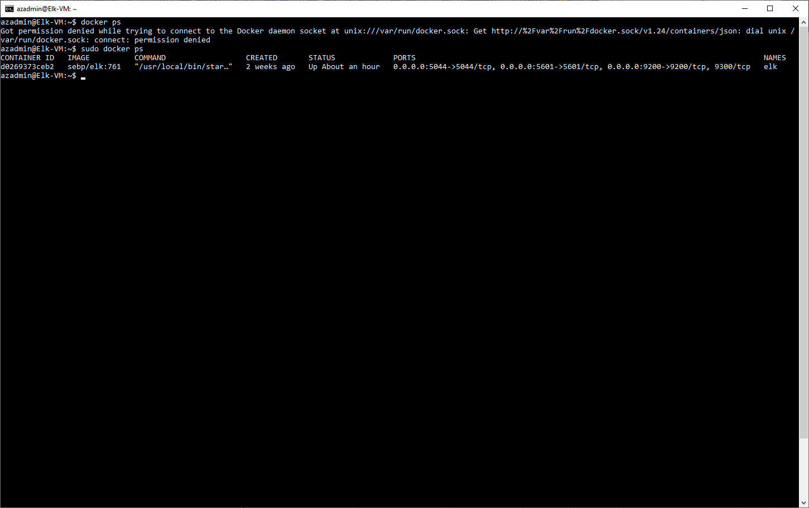

# confident-ritchie

## Automated ELK Stack Deployment

The files in this repository were used to configure the network depicted below.

These files have been tested and used to generate a live ELK deployment on Azure. They can be used to either recreate the entire deployment pictured above. Alternatively, select portions of the Playbook file may be used to install only certain pieces of it, such as Filebeat.

  - _filebeat-playbook.yml._

This document contains the following details:
- Description of the Topology
- Access Policies
- ELK Configuration
  - Beats in Use
  - Machines Being Monitored
- How to Use the Ansible Build

### Description of the Topology

The main purpose of this network is to expose a load-balanced and monitored instance of DVWA, the D*mn Vulnerable Web Application.

Load balancing ensures that the application will be highly available, in addition to restricting traffic to the network.
- _Load Balancers help protect the network from DOS attacks by rerouting traffic if a server goes down. _

Integrating an ELK server allows users to easily monitor the vulnerable VMs for changes to the VMs and system files.
- _Filebeat collects data from specific files._
- _Metricbeat collects information about the machine, such as uptime and CPU usage._

The configuration details of each machine may be found below.
_Note: Use the [Markdown Table Generator](http://www.tablesgenerator.com/markdown_tables) to add/remove values from the table_.

| Name     | Function   | IP Address | Operating System |
|----------|------------|------------|------------------|
| Jump Box | Gateway    | 10.0.0.6   | Linux            |
| Web-1    | VM         | 10.0.0.7   | Linux            |
| Web-2    | VM         | 10.0.0.8   | Linux            |
| Web-3    | VM         | 10.0.0.9   | Linux            |
| ELK-VM   | Monitoring | 10.1.0.4   | Linux            |

### Access Policies

The machines on the internal network are not exposed to the public Internet. 

Only the Jump Box machine can accept connections from the Internet. Access to this machine is only allowed from the following IP addresses:
- _24.130.209.155_

Machines within the network can only be accessed by the Jump Box.
- _The Jump Box's IP Address is 10.0.0.6_

A summary of the access policies in place can be found in the table below.

| Name     | Publicly Accessible | Allowed IP Addresses |
|----------|---------------------|----------------------|
| Jump Box | No                  | 24.130.209.155       |
|          |                     |                      |
|          |                     |                      |

### Elk Configuration

Ansible was used to automate configuration of the ELK machine. No configuration was performed manually, which is advantageous because...
- _it installs all the necessary packages and configures settings in one go. Moreover, should you need to destroy and recreate the machine, it can be done fairly quickly and will be exactly the same as when it was first configured. _

The playbook implements the following tasks:
- Installation of apt packages: docker.io and python3-pip.
   - Docker is the engine that runs the container
   - Python3-pip installs the Python software
- Installation of pip package: docker, the python client for docker
- Download and launch the docker elk container, as well as enabling the docker service on boot.

The following screenshot displays the result of running `docker ps` after successfully configuring the ELK instance.

### Target Machines & Beats
This ELK server is configured to monitor the following machines:
- _10.0.0.7, 10.0.0.8, 10.0.0.8_

We have installed the following Beats on these machines:
- _Filebeat and Metricbeat_

These Beats allow us to collect the following information from each machine:
- _Filebeat allows us to collect log files from specific files, while Metricbeat allows us to collect about the machine in our network._

### Using the Playbook
In order to use the playbook, you will need to have an Ansible control node already configured. Assuming you have such a control node provisioned: 

SSH into the control node and follow the steps below:
- Copy the _____ file to _____.
- Update the _____ file to include...
- Run the playbook, and navigate to ____ to check that the installation worked as expected.

_TODO: Answer the following questions to fill in the blanks:_
- _filebeat-playbook.yml. /etc/ansible/roles_
- _filebeat-config.yml to include the IP Addresses of the machines you want to install Filebeat on_
- _http://[your-VM-IP]:5601/app/kibana

_As a **Bonus**, provide the specific commands the user will need to run to download the playbook, update the files, etc._
